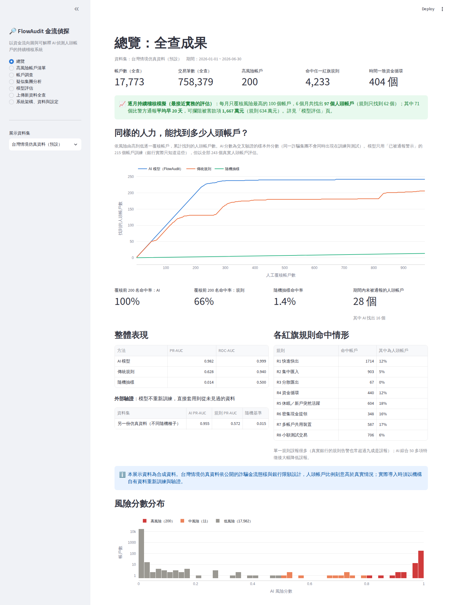

# FlowAudit 金流偵探

**以資金流向圖與可解釋 AI 偵測人頭帳戶的持續稽核系統**

傳統稽核是抽樣查核，只看單筆交易有沒有超過門檻；人頭帳戶的特徵卻藏在「帳戶與帳戶之間的關係」與「資金移動的速度」裡。
FlowAudit 對所有交易**全查**：先用 8 條對應法規態樣的紅旗規則檢核，再把交易建成資金流向圖、萃取 57 項特徵交給 AI 評分，
以 TreeSHAP 說明每個帳戶為什麼可疑，並自動產出可疑交易分析報告與稽核工作底稿。



---

## 重點成果（台灣情境仿真資料，17,773 個帳戶、758,379 筆交易）

**最接近實務的評估：逐月持續稽核模擬。** 每月 1 日只用當時已有的交易、只知道當時已被警示的帳戶，覆核風險最高的 100 個帳戶：

| 6 個月、共覆核 600 個帳戶 | AI 模型 | 傳統規則 | 隨機抽樣 |
|---|---|---|---|
| 找出的人頭帳戶（不重複） | **97 個** | 62 個 | 約 2 個 |
| 比警方通報更早發現 | **71 個，平均早 20 天** | 39 個 | — |
| 期間內從未被通報、由系統找出 | 26 個 | 23 個 | — |
| 可攔阻的被害款項 | **1,667 萬元** | 634 萬元 | — |

以每件覆核 30 分鐘、時薪 800 元（假設值）估算，半年人力成本約 24 萬元，攔阻金額約為人力成本的 69 倍。

**其他驗證：**

| 評估 | 結果 |
|---|---|
| 多模型比較（集團層級 5 折交叉驗證，PR-AUC，95% 信賴區間） | XGBoost 0.982 [0.970, 0.991]、隨機森林 0.990、邏輯斯迴歸 0.906、**現行規則 0.628**、孤立森林（非監督）0.274、隨機 0.014 |
| 外部驗證（另一個隨機種子產生、從未見過的仿真資料） | AI 0.955｜規則 0.572 |
| 未被通報的人頭帳戶 | 28 個期間內從未被警示，AI 在前 243 名中找出 16 個 |
| 誤判分析 | 規則把 100% 的團購主與代收帳戶、99% 的發薪公司、96% 的房東、84% 的個人賣家判為可疑；AI 的誤判率最高為代收帳戶的 5.3%，其餘皆接近 0% |
| 各詐騙類型檢出率 | 假投資 99%、網購詐騙 99%、解除分期 100%、**循環交易 29%**（最難，為未來改進方向） |
| 消融實驗 | 任一類特徵拿掉後 PR-AUC 最多只降 0.015，系統不依賴單一訊號 |

> **限制：** 以上皆為**合成資料**。仿真器依公開資料設計並刻意加入大量「像人頭帳戶但正常」的帳戶，仍不等於真實資料。
> 實際導入須以機構自有資料重新訓練與驗證。報告書與簡報請主動說明這一點。

---

## 快速開始

需要 Python 3.10 以上。

| 系統 | 做法 |
|---|---|
| Windows | 雙擊 `run_windows.bat` |
| macOS / Linux | 執行 `./run_mac_linux.sh` |

第一次執行會安裝套件並完成全查與模型訓練（約 2～3 分鐘），接著開啟儀表板 <http://localhost:8501>。
評估結果（`outputs/tw_sim/evaluation.json`）已隨附；要重新評估可在「模型評估」頁按鈕執行，或用下方指令。

```bash
pip install -r requirements.txt
python -m flowaudit.simulator         # 重新產生台灣情境仿真資料（已隨附，可略過）
python -m flowaudit.pipeline          # 規則全查 + 特徵 + 模型訓練 + 外部驗證
python -m flowaudit.evaluation        # 多模型比較、消融、逐月模擬、誤判分析（約 5 分鐘）
streamlit run app.py                  # 開啟儀表板
pytest -q                             # 執行測試
```

---

## 系統架構

```
交易資料（時間、金額、管道、登入裝置、開戶資料）
   │
   ├─① 規則引擎（rules.py）         8 條紅旗規則全查，每條對應調查局疑似洗錢態樣或金管會管理辦法，附證據文字
   ├─② 特徵工程（features.py）      交易行為、資金流速、時間與管道、資金網路圖、帳戶屬性與裝置，共 57 項
   ├─③ 風險模型（model.py）         XGBoost；只用「已被警示」的帳戶訓練（貼近實務），集團層級交叉驗證
   ├─④ 可解釋性（model.py）         TreeSHAP：逐帳戶拆解每個特徵對風險的貢獻
   ├─⑤ 疑似集團偵測（pipeline.py）   在可疑帳戶子圖上做 Louvain 社群偵測
   ├─⑥ 報告生成（report.py）        模板／LLM 撰寫可疑交易分析報告，匯出 Word 與 Excel 工作底稿
   ├─⑦ 嚴謹評估（evaluation.py）    多模型比較、消融、逐月持續稽核模擬、成本效益、誤判分析
   └─⑧ 稽核儀表板（app.py）         7 個頁面，可上傳新資料現場全查
```

### 紅旗規則（門檻在 `config.yaml` 調整，不需改程式）

| 代碼 | 規則 | 對應態樣／法規 | 判斷方式（預設） |
|---|---|---|---|
| R1 | 快進快出 | 態樣 A15、A16、A17 | 流入後 24 小時內轉出或提領 ≥ 80%，至少 2 次 |
| R2 | 集中匯入 | 態樣 A17 | 7 日內不同匯入來源數 ≥ 該客群第 95 百分位 |
| R3 | 分散匯出 | 態樣 A18 | 7 日內不同匯出對象數 ≥ 該客群第 95 百分位 |
| R4 | 資金循環 | 態樣 A18 | 依時間先後、金額相近（0.5～1.2 倍）經 2～5 個帳戶回流，30 日內完成 |
| R5 | 休眠／新戶突然活躍 | 態樣 A15、A16；管理辦法第 4 條 | 開戶 ≤ 90 天或未往來 ≥ 180 天，開始使用 14 日內流入 ≥ 5 萬且轉出 ≥ 70% |
| R6 | 密集現金提領 | 態樣 A11、A12 | 24 小時內 ATM／臨櫃提領 ≥ 3 次且 ≥ 5 萬元 |
| R7 | 多帳戶共用裝置 | 態樣 A1G | 同一登入裝置有 ≥ 3 個帳戶轉入同一受款帳號 |
| R8 | 小額測試交易 | 管理辦法第 4 條 | 72 小時內 ≥ 3 筆 30 元以下轉出入 |

「態樣」指法務部調查局〈疑似洗錢或資恐交易態樣〉銀行業代碼；「管理辦法」指《存款帳戶及其疑似不法或顯屬異常交易管理辦法》。
規則門檻依客群（個人、商家、公司）分別計算。資料缺少時間、現金、裝置或開戶欄位時，對應規則自動改用替代判斷或不觸發。

---

## 資料

| 資料 | 說明 | 使用方式 |
|---|---|---|
| **台灣情境仿真資料**（預設，已內附） | 新台幣、交易時間、管道、登入裝置、開戶日、休眠天數；20 個詐騙集團（假投資、網購、解除分期、循環交易）與大量容易誤判的正常帳戶。設計依據見 [docs/仿真設計與參數依據.md](docs/仿真設計與參數依據.md) | 預設 |
| **IBM AMLSim 樣本**（已內附） | IBM 開源反洗錢模擬器的 20K 帳戶樣本，Apache-2.0 授權，見 `data/raw/AMLSim_LICENSE.txt` | 儀表板左側切換；`python -m flowaudit.pipeline --dataset amlsim_fanin_cycle` |
| **IBM AMLworld**（需自行下載） | Kaggle「IBM Transactions for Anti Money Laundering」，如 `HI-Small_Trans.csv` | `python -m flowaudit.pipeline --amlworld HI-Small_Trans.csv` |
| 任意 CSV | 需含 `src, dst, amount` 以及 `step` 或 `date`；可選 `channel`、`device_id`，現金存提的對手填 `CASH` | 儀表板「上傳新資料全查」 |

`data/demo_upload/` 內附一份示範用交易檔，可在上傳頁面現場展示全查流程。

---

## 評估方法為什麼可信

1. **只用已警示帳戶訓練：** 銀行實際只知道「已被通報」的警示帳戶。模型只用這些訓練，但以全部真實人頭帳戶評估，才看得出能否找到「還沒被通報」的帳戶。
2. **集團層級交叉驗證：** 同一詐騙集團的帳戶不會同時出現在訓練與測試，避免模型只是記住某個集團。
3. **逐月持續稽核模擬：** 每月只用當時已有的資料；被找到的帳戶當月凍結，不重複計算。第一個月警示資料少，自動退回規則排序（冷啟動）。
4. **大量困難的正常樣本：** 團購主、標會會頭、代收班費、個人賣家、發薪公司、薪轉後轉出、休眠後領保險金、家人共用手機、記帳士代管網銀等。
5. **誠實呈現負面結果：** 隨機森林的 PR-AUC 略高於 XGBoost（採用 XGBoost 是因為能精確計算 TreeSHAP 且訓練快）；「規則＋AI 加權」的雙層排序反而比 AI 單獨排序差；循環交易檢出率只有 29%。

---

## LLM 報告生成（選用）

預設用模板產生報告，**完全離線也能運作**。要改由大型語言模型撰寫，先設定環境變數：

```bash
# Windows (PowerShell)
$env:ANTHROPIC_API_KEY="你的金鑰"      # 或 $env:OPENAI_API_KEY="..."
# macOS / Linux
export ANTHROPIC_API_KEY=你的金鑰
```

模型名稱可在 `config.yaml` 或環境變數 `FLOWAUDIT_ANTHROPIC_MODEL`、`FLOWAUDIT_OPENAI_MODEL` 修改。
送給 LLM 的只有「結構化事實」（規則證據、SHAP 依據、交易統計），並要求不得杜撰；呼叫失敗時自動退回模板。

---

## 專案結構

```
flowaudit/
├── app.py                        Streamlit 儀表板
├── config.yaml                   規則門檻、模型參數、LLM 設定
├── flowaudit/
│   ├── simulator.py              台灣情境交易仿真器
│   ├── data_loader.py            仿真資料 / AMLSim / AMLworld / 一般 CSV 讀取
│   ├── rules.py                  8 條紅旗規則（含時間一致資金循環搜尋）
│   ├── features.py               57 項特徵（5 大類）
│   ├── model.py                  XGBoost、集團層級交叉驗證、TreeSHAP、成效指標
│   ├── pipeline.py               端對端流程、疑似集團偵測、外部驗證
│   ├── evaluation.py             多模型比較、消融、逐月模擬、誤判分析
│   └── report.py                 可疑交易分析報告、Word 匯出、Excel 工作底稿
├── data/raw/tw_sim/              台灣情境仿真資料
├── data/raw/                     AMLSim 公開樣本
├── data/demo_upload/             上傳功能示範資料
├── docs/仿真設計與參數依據.md      仿真參數與出處
├── docs/screenshots/             儀表板截圖
├── tests/                        pytest 測試（14 項）
└── outputs/                      執行結果（evaluation.json 已隨附）
```

---

## 比賽提醒

- 影片、報告書、海報**不得出現姓名與學校名稱**。本系統介面沒有任何隊伍資訊；錄影或截圖前，確認瀏覽器分頁、書籤列、電腦使用者名稱與檔案路徑都不會露出個人資訊。
- 決賽 Demo 建議順序：總覽的逐月模擬成果 → 帳戶調查（SHAP、網路圖、產生報告）→ 模型評估的誤判分析 → 上傳新資料全查。
- 現場沒有網路時，除了 LLM 撰寫，所有功能都能離線運作。
